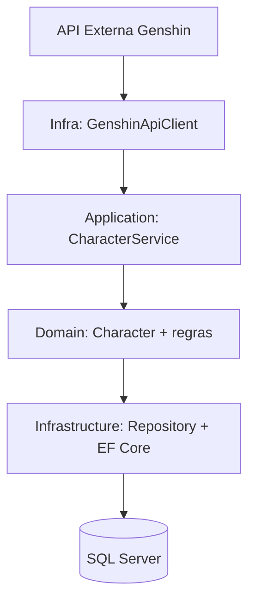
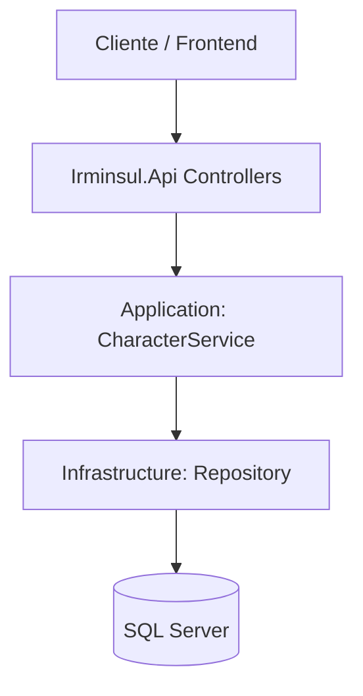

# IRMINSUL — Backend

Backend do IRMINSUL: uma API REST em .NET responsável por centralizar, validar, persistir e expor dados de personagens de Genshin Impact, incluindo integração com uma API externa.

## Sobre o projeto

IRMINSUL é uma plataforma de informações de personagens de **Genshin Impact**.  
No backend, o objetivo é consolidar os dados em uma **API própria**, com regras internas de validação, tratamento de erros e persistência em banco relacional.

Em vez de depender diretamente do consumo da API externa em cada cliente, o projeto mantém uma camada de backend independente, com domínio e armazenamento próprios, permitindo controle técnico e evolução contínua da solução.

## Objetivo

Os objetivos técnicos do backend são:

- construir uma API REST organizada e de fácil manutenção;
- separar responsabilidades entre camadas (API, Application, Domain e Infrastructure);
- aplicar regras de negócio de forma centralizada;
- persistir dados em SQL Server com Entity Framework Core;
- integrar dados vindos de uma API externa de Genshin;
- validar entradas com FluentValidation;
- tratar exceções de forma centralizada via middleware;
- preparar a base para futuras expansões funcionais.

## Arquitetura

A solução segue uma arquitetura em camadas, com responsabilidades bem definidas.

### Fluxo de importação (API externa → banco local)



### Fluxo de consumo da aplicação cliente



As camadas se comunicam de forma direcionada: a API orquestra requisições HTTP, a Application aplica regras e casos de uso, a Domain define o núcleo do negócio e a Infrastructure executa persistência e integrações externas.

## Decisões de arquitetura

### Separação de responsabilidades

O projeto foi dividido em projetos independentes para manter baixo acoplamento e facilitar manutenção, testes e evolução.

### Domain

A camada de domínio concentra entidades e enums fundamentais do sistema (como `Character`), sem dependência direta de infraestrutura, preservando o núcleo de regras de negócio.

### Application

A camada de aplicação organiza serviços, DTOs, interfaces, validações e exceções de negócio.  
Ela coordena os casos de uso e define como a API conversa com domínio e infraestrutura.

### Infrastructure

A infraestrutura implementa persistência e integração externa:

- Entity Framework Core;
- SQL Server;
- repositórios (`ICharacterRepository`);
- cliente HTTP para API externa (`IGenshinApiClient` / `GenshinApiClient`).

### API

A camada `Irminsul.Api` é a porta de entrada HTTP:

- controllers;
- mapeamento de endpoints;
- middleware global de exceções;
- configuração de DI;
- documentação OpenAPI (Swagger/OpenAPI + Scalar).

### Por que o IRMINSUL possui sua própria API?

Tecnicamente, a API própria funciona como camada intermediária entre clientes e fonte externa, permitindo ao sistema controlar:

- modelo de dados interno;
- persistência local;
- validação consistente;
- regras de negócio;
- tratamento padronizado de erros;
- evolução sem quebrar o contrato dos consumidores.

### Por que não depender diretamente da API externa?

A dependência direta de um fornecedor externo reduz controle sobre contrato, disponibilidade e evolução do produto.  
Com persistência e API próprias, o IRMINSUL consegue manter consistência interna e autonomia técnica, sem desqualificar a API externa — apenas reduzindo acoplamento estrutural.

## Tecnologias

| Tecnologia | Utilização |
|---|---|
| C# | Linguagem principal |
| .NET | Plataforma do backend |
| ASP.NET Core | Construção da API |
| Entity Framework Core | ORM e persistência |
| SQL Server | Banco de dados |
| FluentValidation | Validação |
| xUnit | Testes |
| Moq | Mocking em testes |
| OpenAPI/Swagger | Contrato e documentação da API |
| Scalar | Interface de referência/interação da API |
| Git | Controle de versão |

## Estrutura do projeto

```text
backend/
├── Irminsul.Api/
├── Irminsul.Application/
├── Irminsul.Domain/
├── Irminsul.Infrastructure/
├── Irminsul.Tests/
└── Irminsul.slnx
```

### Responsabilidade de cada projeto

- **Irminsul.Api**: camada HTTP (controllers, middleware, startup/configuração).
- **Irminsul.Application**: serviços, interfaces, DTOs, validações e exceções de aplicação.
- **Irminsul.Domain**: entidades e enums centrais do domínio.
- **Irminsul.Infrastructure**: EF Core, DbContext, repositórios, migrations e integração externa.
- **Irminsul.Tests**: testes automatizados da regra de aplicação.

## Camadas

### Domain

Contém o núcleo do modelo de negócio, com destaque para a entidade `Character` e enums relacionados ao domínio de personagens.

### Application

Concentra:

- `CharacterService`;
- DTOs de entrada/saída;
- interfaces (`ICharacterRepository`, `IGenshinApiClient`);
- validações (FluentValidation);
- exceções de negócio (ex.: não encontrado, duplicidade).

### Infrastructure

Responsável por:

- `IrminsulContext` (DbContext);
- mapeamento e persistência com EF Core;
- configurações de entidades;
- implementação de repositórios;
- cliente HTTP da API externa;
- migrations e manutenção do schema.

### API

Responsável por:

- controllers e rotas REST;
- middleware global (`ExceptionHandlingMiddleware`);
- configuração da aplicação em `Program.cs`;
- injeção de dependências;
- OpenAPI (`AddOpenApi`, `MapOpenApi`) e Scalar (`MapScalarApiReference`).

## Banco de dados

O backend utiliza **SQL Server** com **Entity Framework Core** para persistência.

### Pontos principais

- `IrminsulContext` define o acesso ao banco.
- As entidades são configuradas na infraestrutura.
- Migrations versionam o schema do banco.
- A persistência é feita via repositório e DbContext.

### Índice único em `Character.Name`

Existe a preocupação de evitar duplicidade de personagens pelo nome.  
Esse controle impede inconsistência quando o mesmo personagem é importado/cadastrado mais de uma vez e reforça integridade dos dados no banco.

## API

> Observação: os endpoints abaixo devem refletir os controllers atuais do projeto backend.

| Método | Endpoint | Descrição |
|---|---|---|
| GET | `/characters` | Lista personagens persistidos. |
| GET | `/characters/{id}` | Retorna um personagem por identificador. |
| POST | `/characters` | Cria um novo personagem. |
| PUT | `/characters/{id}` | Atualiza um personagem existente. |
| DELETE | `/characters/{id}` | Remove um personagem. |
| POST | `/characters/import/{name}` | Importa personagem da API externa e persiste localmente. |

### Comportamento esperado (resumo)

- **GET `/characters`**: retorna coleção de personagens.
- **GET `/characters/{id}`**: retorna um item; se não existir, responde erro de não encontrado.
- **POST `/characters`**: valida DTO, aplica regras e cria recurso.
- **PUT `/characters/{id}`**: valida entrada, atualiza se existir.
- **DELETE `/characters/{id}`**: remove registro quando encontrado.
- **POST `/characters/import/{name}`**: busca na API externa, converte para modelo interno, evita duplicidade e persiste.

## Integração com API externa

A integração ocorre por meio de:

- interface `IGenshinApiClient` (Application);
- implementação `GenshinApiClient` (Infrastructure/External), registrada via `AddHttpClient` com `BaseAddress` para `https://genshin-db-api.vercel.app/`.

### Fluxo de importação

1. A API recebe requisição de importação (`/characters/import/{name}`).
2. A Application solicita dados externos via `IGenshinApiClient`.
3. Os dados externos são convertidos para o modelo de domínio.
4. O sistema verifica duplicidade.
5. O personagem é persistido no SQL Server.
6. A API retorna o resultado ao cliente.

Alguns dados externos são adaptados para enums/modelos internos do IRMINSUL, garantindo consistência do domínio local.

## Validação

O projeto utiliza **FluentValidation** (registrado por extensão de DI na API).

### Como funciona

- validações são definidas na camada de aplicação;
- DTOs de entrada passam por validação antes da execução das regras de negócio;
- erros de validação são retornados ao cliente de forma padronizada;
- status HTTP esperado para falha de validação: **400 Bad Request**.

## Tratamento de exceções

O backend possui middleware global: `ExceptionHandlingMiddleware`.

Ele centraliza o mapeamento de exceções para respostas HTTP padronizadas, evitando duplicação de `try/catch` nos controllers.

| Exceção/Situação | HTTP | Significado |
|---|---:|---|
| `CharacterNotFoundException` | 404 | Personagem não encontrado. |
| `CharacterAlreadyExistsException` | 409 | Já existe personagem com os mesmos critérios de unicidade. |
| Erro inesperado | 500 | Falha interna não prevista, sem expor detalhes sensíveis. |

## Testes

A solução possui testes automatizados em `Irminsul.Tests`, com foco em regras da camada de aplicação (especialmente `CharacterService`).

### Stack de testes

- **xUnit** para estrutura dos testes;
- **Moq** para criação de mocks (ex.: `ICharacterRepository`).

### Cobertura de cenários

- cenários de sucesso;
- cenários de personagem inexistente;
- verificação de chamadas esperadas ao repositório.

> O número exato de testes passando pode variar conforme evolução do branch.  
> Para conferir localmente:

```bash
dotnet test backend/Irminsul.Tests/Irminsul.Tests.csproj
```

## Documentação da API

A API expõe documentação OpenAPI e referência via Scalar (em ambiente de desenvolvimento).

Com a aplicação em execução no profile de desenvolvimento, os mapeamentos em `Program.cs` habilitam:

- `app.MapOpenApi();`
- `app.MapScalarApiReference();`

## Como executar

### Pré-requisitos

- .NET SDK (compatível com os projetos do backend);
- SQL Server;
- IDE compatível (Visual Studio, Rider ou VS Code);
- Git.

### Configuração

A conexão é lida de `ConnectionStrings:DefaultConnection` (em `appsettings.json` / `appsettings.Development.json` da API).

Exemplo com placeholders:

```json
{
  "ConnectionStrings": {
    "DefaultConnection": "Server=SEU_SERVIDOR;Database=IrminsulDb;User Id=SEU_USUARIO;Password=SUA_SENHA;TrustServerCertificate=True"
  }
}
```

### Banco de dados

A infraestrutura contém migrations.  
Fluxo comum com EF CLI (na raiz `backend/`):

```bash
dotnet ef database update --project Irminsul.Infrastructure --startup-project Irminsul.Api
```

Para criar novas migrations futuras:

```bash
dotnet ef migrations add NomeDaMigration --project Irminsul.Infrastructure --startup-project Irminsul.Api
```

### Executar a API

Na pasta `backend/`:

```bash
dotnet restore
dotnet build
dotnet run --project Irminsul.Api
```

## Exemplos de resposta

> Exemplos estruturais compatíveis com o contrato esperado (podem variar em campos conforme DTOs atuais).

### Sucesso (200)

```json
{
  "id": 1,
  "name": "Diluc",
  "weapon": "Claymore",
  "element": "Pyro"
}
```

### Erro 404 (personagem não encontrado)

```json
{
  "message": "Character not found."
}
```

### Erro 409 (duplicidade)

```json
{
  "message": "Character already exists."
}
```

### Erro 400 (validação)

```json
{
  "errors": {
    "Name": [
      "Name is required."
    ]
  }
}
```

### Erro 500 (inesperado)

```json
{
  "message": "An unexpected error occurred."
}
```

## Roadmap

### V1 (implementado)

- API REST para gerenciamento de personagens;
- integração com API externa para importação;
- persistência em SQL Server;
- validação com FluentValidation;
- tratamento global de exceções;
- testes automatizados da camada de aplicação.

### V2 (planejado)

- expansão de lore de personagens;
- talentos;
- constelações;
- builds;
- artefatos;
- enriquecimento geral de dados.

> Itens de V2 são objetivos futuros e **não** fazem parte da implementação atual.

## Autor

Projeto mantido por **yBreno**.
